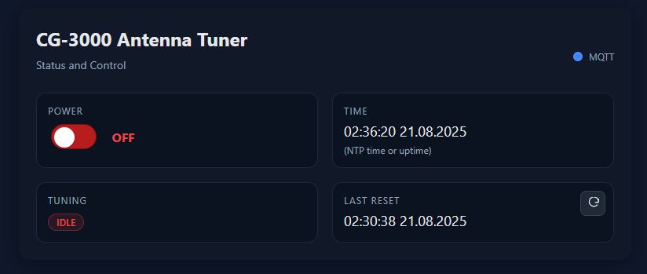

# CG3000 Remote Controller (ESP32 Relay X2)

This project replaces the original CG3000 tuner remote control with an [ESP32 Relay X2 board (ESP32‑WROOM‑32E)](https://www.amazon.de/dp/B0B97L9446?&tag=amazon313-21).
The ESP32 controls the tuner via onboard relays and serves a Wi‑Fi web interface for status and control.

---

## Features

- Wi‑Fi Manager with captive portal
  - First boot: ESP32 opens AP `CG3000-Setup` (password: `tuner1234`)
  - Configure your Wi‑Fi once (SSID and password)
  - Automatically reconnects on next boot
  - If Wi‑Fi is unavailable, it falls back to AP mode

- Web interface (responsive, no external libraries)
  - Tiles: Tuning (ACTIVE/IDLE), Time (NTP time or uptime), Power (switch), Last Reset (timestamp)
  - Power as a switch (red = OFF, green = ON)
  - Last Reset tile includes an icon button to trigger a reset pulse
  - Automatic status refresh every 2 seconds

- Time handling
  - Uses NTP to show local time when available
  - If NTP is not available, shows time since last restart (uptime)
  - Optional: last reset time is "-" until NTP is available

- Relay and I/O logic
  - Relay 1 (GPIO 16): Reset (inverted 250 ms pulse)
  - Relay 2 (GPIO 17): Power ON/OFF
  - GPIO 34: Tuning input (yellow wire, via voltage divider)

---

## Hardware

### Required components

- [ESP32 Relay X2 board (ESP32‑WROOM‑32E)](https://www.amazon.de/dp/B0B97L9446?&tag=amazon313-21)
- 2 resistors for a voltage divider (33 kΩ + 10 kΩ) for the tuning input (yellow wire)

### Power

- The ESP32 Relay X2 board accepts a wide input range (about 7–60 V).
- You can supply 13.8 V directly to the board’s VIN/Power input.
- GND of tuner and ESP32 Relay X2 must be common.

### Wiring

1. Relays

- Relay 1 (GPIO 16) → Reset line (yellow)
  - Active HIGH → 500 ms pulse
- Relay 2 (GPIO 17) → Tuner power line (switches 13.8 V via the onboard relay)
  - Depending on relay board wiring: HIGH = OFF, LOW = ON (adjust server logic if needed)

2. Status input

- Yellow wire (Tuning active) → Voltage divider 33 kΩ + 10 kΩ → GPIO 34
  - Divides 13.8 V to a safe input level for the ESP32

3. Notes

- Red (Power) not needed → power is known from the relay state
- Yellow (Reset) is controlled by the relay

---

## Software

### Install VS Code and PlatformIO

- Download and install Visual Studio Code from the official website.
- Open VS Code → Extensions (Ctrl+Shift+X) → search "PlatformIO IDE" → Install.
- Click the PlatformIO icon in the Activity Bar to initialize PlatformIO.
- Clone or open this project folder (File → Open Folder…).
- If prompted, allow PlatformIO to install required toolchains/frameworks.
- Build: use the PlatformIO toolbar (checkmark) or Command Palette "PlatformIO: Build".
- Upload: connect the ESP32 via USB → "PlatformIO: Upload".
- Monitor: "PlatformIO: Serial Monitor" (select correct COM port, baud 115200).

### Flashing

1. Connect the ESP32 Relay X2 via USB
2. Upload the firmware (e.g., via PlatformIO)
3. If the board does not auto‑reset after flashing, press the reset button

### First‑time setup and usage

1. On first boot, connect to Wi‑Fi network `CG3000-Setup` (password: `tuner1234`)
2. Enter your Wi‑Fi SSID and password in the captive portal
3. The ESP32 reboots and connects to your Wi‑Fi
4. Open the ESP32’s IP address in your browser to access the web UI

### Web UI overview

- Tuning: badge shows ACTIVE/IDLE (from the yellow wire input)
- Time: shows local NTP time; if not available, shows "Since restart: <uptime>"
- Power: switch with red (OFF) / green (ON), plus ON/OFF label
- Last Reset: shows timestamp; includes an icon button to trigger a 500 ms reset pulse

---

## Endpoints

### HTTP

- GET / → serves the web UI
- GET /status → JSON with fields:
  - power: boolean
  - tuning: boolean
  - lastReset: number (epoch seconds)
  - time: number (epoch seconds)
  - lastResetStr: string (formatted or "-")
  - timeStr: string (formatted time or uptime text)
  - timeValid: boolean (true if NTP time is valid)
- POST /power → toggles power
- POST /reset → triggers a 500 ms reset pulse

### MQTT

Asynchronous MQTT status and control to avoid blocking the web UI.

- Broker: mqtt.ham.local (resolved via DNS/mDNS with exponential backoff)
- Port: 1883 (no TLS/auth by default)
- Base topic: cg3000/<deviceId>/...
  - Example: cg3000/cg3000-ABCD1234/...

Topics

- State (retained)
  - cg3000/<deviceId>/power/state → "ON" | "OFF"
  - cg3000/<deviceId>/tuning/state → "ON" | "OFF"
  - cg3000/<deviceId>/lastReset/str → formatted timestamp or "-"
  - cg3000/<deviceId>/time/str → formatted time or uptime text
- Commands
  - cg3000/<deviceId>/power/set → "ON" | "OFF" | "TOGGLE"
  - cg3000/<deviceId>/reset/set → any payload triggers a 500 ms reset pulse

Discovery (custom, retained)

- Minimal config under ham/... to allow your own system to discover the device:
  - ham/switch/<deviceId>_power/config
  - ham/button/<deviceId>_reset/config
  - ham/binary_sensor/<deviceId>_tuning/config
  - ham/sensor/<deviceId>_lastreset/config
  - ham/sensor/<deviceId>_time/config
- Payloads contain id, referenced cmd/state topics, and a compact device object (id, manufacturer, model, name).

Publish strategy

- Publish only on value changes, or at least every 5 minutes (heartbeat).
- All state topics are retained so new subscribers receive the current state immediately.

Web UI

- A dot in the top-right indicates MQTT connection:
  - green = connected
  - blue = not connected

Dependencies (PlatformIO)

- ottowinter/AsyncMqttClient
- me-no-dev/AsyncTCP
- tzapu/WiFiManager

Examples

- Toggle power:
  - mosquitto_pub -h mqtt.ham.local -t "cg3000/<deviceId>/power/set" -m "TOGGLE"
- Read current power state:
  - mosquitto_sub -h mqtt.ham.local -t "cg3000/<deviceId>/power/state" -v

---

## Notes and tips

- Safety: verify your voltage divider for the yellow wire before connecting to GPIO 34
- Relay polarity: if your relay board is LOW‑active, invert your server read/write logic accordingly

---

## Disclaimers and safety

- High voltage and RF: your tuner setup may involve higher voltages and RF energy. Ensure proper insulation, grounding, and RF safety practices.
- Board power: although the ESP32 Relay X2 accepts 7–60 V, always double‑check polarity and wiring before powering the board.
- ESD: handle the ESP32 and wiring with ESD precautions to avoid damage.
- Responsibility: use at your own risk. The authors and contributors assume no liability for damages or compliance issues.
- Environment: keep the device dry and away from conductive or flammable materials.

---

## Affiliate disclosure

- The product link above may be part of the Amazon Partner Program (affiliate link). If you purchase via this link, we may receive a small commission at no additional cost to you.
- This does not influence the content or recommendations in this project.

---

## Summary

- ESP32 Relay X2 replaces the original CG3000 remote
- Wi‑Fi web UI for Tuning, Time/Uptime, Power (switch), and Last Reset (with reset icon)
- Wide input range (7–60 V) → 13.8 V can be connected directly to the board
- Wi‑Fi Manager for easy setup and fallback AP
- Robust time handling with NTP fallback to uptime
